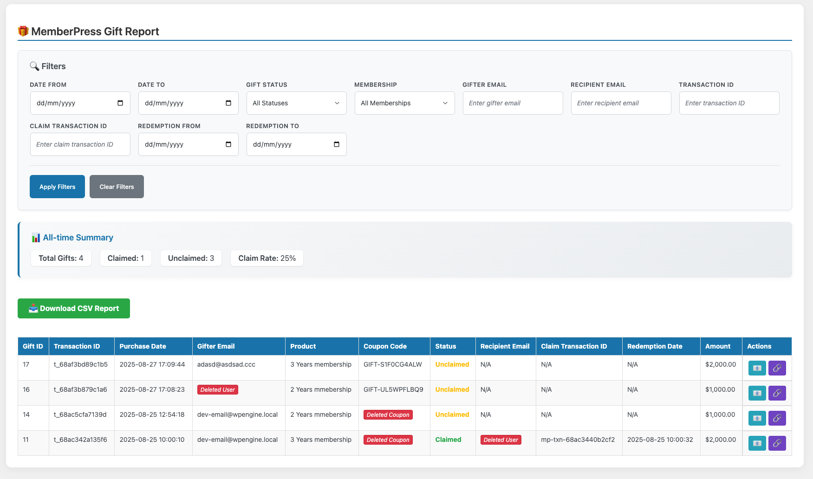

# MemberPress Gift Reporter

**Note: This is an independent plugin developed by Omar ElHawary. It is not an official MemberPress plugin.**

A comprehensive WordPress plugin that generates detailed reports for the MemberPress Gifting add-on, showing the linkage between gift givers and recipients. This plugin provides advanced filtering, CSV export capabilities, automated reminder emails, and a modern admin interface.

## Plugin Information

- **Version:** 1.6.2
- **Requires at least:** WordPress 5.0
- **Tested up to:** WordPress 6.9
- **Requires PHP:** 7.4 or higher
- **License:** GPLv2 or later
- **Author:** Omar ElHawary
- **Tags:** memberpress, gifting, reports, csv export, reminders, analytics

## Requirements

- WordPress 5.0 or higher
- PHP 7.4 or higher
- MemberPress plugin (active)
- MemberPress Gifting add-on (active)
- MySQL 5.7+ or MariaDB 10.2+

## 📝 Changelog

### Version 1.6.2 (2026-01-10)

#### 🔧 Technical Updates
- Updated tested WordPress version to 6.9
- Improved plugin header documentation

### Version 1.6.1 (2026-01-02)

#### 🐛 Bug Fixes
- **Fixed Gift Checkout Links**: Fixed issue where gift redemption links were using hardcoded `/memberpress-checkout/` path instead of actual product URLs
- **Improved Link Generation**: Redemption links now use the product's actual URL (matching MemberPress Gifting plugin behavior) with coupon parameter appended
- **Better Compatibility**: Links now work correctly regardless of custom checkout page configurations or permalink structures

#### 🔧 Technical Updates
- Added `generate_redemption_url()` helper function to properly generate gift redemption URLs using product URLs
- Updated all redemption link generation to use product URL method instead of hardcoded paths
- Improved fallback handling for cases where MemberPress classes aren't available

### Version 1.6.0 (2025-11-10)

#### 🎉 New Features
- **Weekly Summary Emails**: New automated weekly summary email feature that sends administrators a comprehensive overview of gift activity
- **Weekly Cron Schedule**: Added custom weekly cron schedule support for automated weekly reports
- **Gift Activity Overview**: Weekly summaries include total gifts, claimed/unclaimed statistics, revenue data, and top products
- **Configurable Weekly Reports**: Enable/disable weekly summary emails with customizable settings

#### 🎨 Improvements
- **Enhanced Cron Management**: Improved cron job scheduling and cleanup for both daily reminders and weekly summaries
- **Better Plugin Architecture**: Added support for multiple scheduled tasks with proper initialization and cleanup

#### 🔧 Technical Updates
- Added `MPGR_Weekly_Summary` class for weekly email functionality
- Implemented weekly cron schedule registration via `cron_schedules` filter
- Enhanced plugin activation/deactivation hooks to manage weekly summary cron jobs
- Improved cron hook registration and cleanup processes

### Version 1.5.2 (2025-11-06)

#### 🐛 Bug Fixes
- Fixed reminder scheduling issues and improved reliability
- Enhanced reminder email delivery tracking
- Improved cron job management for reminder system
- Fixed edge cases in reminder schedule processing

### Version 1.5.1 (2025-11-04)

#### 🐛 Bug Fixes
- Fixed various bugs and issues from version 1.5.0
- Improved stability and performance

### Version 1.5.0 (2025-11-04)

#### 🎉 New Features
- **Daily Cron Schedule**: Changed reminder cron schedule from hourly to daily for better performance
- **Orphaned Hook Cleanup**: Automatic cleanup of old/orphaned cron hooks on plugin load

#### 🎨 Improvements
- **Better UI Layout**: Fixed checkbox alignment with description text in reminder settings
- **Code Cleanup**: Removed debug code and console.log statements from production code

#### 🔧 Technical Updates
- Updated cron schedule from hourly to daily for reminder processing
- Added automatic cleanup for orphaned cron hooks (`mpgr_send_reminders`, `mpgr_check_reminders`, `mpgr_send_reminder_emails`)
- Improved code quality by removing debug statements and comments
- Enhanced initialization process to clean up old hooks on every load

### Version 1.4.1 (2025-11-03)

#### 🎉 New Features
- **Email Template Override Support**: Customers can now override the reminder email template by placing a custom template in their theme directory
- **Template System**: New template rendering system with theme override capability following WordPress standards

#### 🎨 Improvements
- **Customizable Emails**: Easy customization of reminder email content, styling, and layout
- **Theme Integration**: Seamless integration with child themes and parent themes
- **Developer Friendly**: Template override system with clear documentation and examples

#### 🔧 Technical Updates
- Refactored email sending methods to use template system
- Added template location methods with theme override support
- Created default email template file in `views/emails/reminder-email.php`
- Enhanced documentation with template override instructions

### Version 1.4.0 (2025-11-03)

#### 🎉 New Features
- **Bulk Resend Gift Emails**: New bulk action to send reminder emails to multiple unclaimed gifts at once
- **Select All Unclaimed**: Quick selection feature to easily select all unclaimed gifts for bulk operations
- **Batch Processing**: Smart batch processing for bulk email sending with progress tracking

#### 🎨 Improvements
- **Enhanced Bulk Operations**: Improved UI for managing multiple gift emails simultaneously
- **Better User Experience**: Streamlined workflow for sending reminder emails to gifters
- **Progress Feedback**: Clear feedback on bulk operations with success/failure counts

#### 🔧 Technical Updates
- Added bulk email handler with rate limiting and error handling
- Implemented checkbox selection system for bulk actions
- Enhanced email validation and delivery tracking
- Improved database queries for better performance on bulk operations

### Version 1.3.0 (2025-10-30)

#### 🎉 New Features
- **Resend Gift Email**: New action button to resend the gift email to the gifter with redemption link
- **Copy Redemption Link**: New action button to copy the redemption link directly to clipboard
- **Actions Column**: Added dedicated actions column in the report table with visual feedback

#### 🎨 Improvements
- **Enhanced User Experience**: Action buttons with tooltips, loading states, and success animations
- **Quick Customer Support**: Easily resend gift information when customers lose their original email
- **Manual Follow-ups**: Copy redemption links for manual outreach via email, chat, or phone

#### 🔧 Technical Updates
- Added action buttons UI with responsive design and accessibility features
- Implemented clipboard API with fallback support for older browsers
- Enhanced CSS with button animations and visual states (loading, success, hover)

### Version 1.2.0 (2025-10-29)

#### 🎉 New Features
- **Transaction ID Filter**: Search and filter by gift purchase transaction ID
- **Claim Transaction ID Filter**: Search and filter by gift redemption/claim transaction ID

#### 🎨 Improvements
- **Enhanced Summary Display**: Redesigned summary statistics with improved inline layout for better readability
- **Increased Filter Count**: Now featuring 10 powerful filters (up from 8) for even more precise data analysis

#### 🔧 Technical Updates
- Updated filter validation and sanitization for new transaction ID fields
- Enhanced JavaScript filtering logic to support transaction ID searches
- Improved data query system to handle transaction number lookups

### Version 1.1.0
- Advanced filtering system with 8 filters
- Date range filtering for purchases and redemptions
- Email filtering for gifters and recipients
- Product/membership filtering
- Gift status filtering
- Filtered CSV exports
- Modern admin interface

### Version 1.0.0
- Initial release
- Basic gift reporting functionality
- CSV export capability
- REST API endpoints

## 🎁 Features

- **Complete Gift Tracking**: Track gift purchases, redemptions, and status
- **Quick Actions**: Built-in action buttons for each gift transaction
  - 📧 Resend gift email to the gifter
  - 🔗 Copy redemption link to clipboard
- **Bulk Operations**: Manage multiple gifts at once
  - Select all unclaimed gifts for bulk operations
  - Bulk resend reminder emails to multiple gifters
  - Batch processing with progress tracking
- **Automatic Reminder System**: Automated email reminders for unclaimed gifts
  - Daily cron schedule for efficient processing
  - Multiple customizable reminder schedules (hours or days)
  - Fully customizable email templates with variable support
  - Test email functionality to preview emails
  - Theme override support for email templates
- **Advanced Filtering System**: 10 powerful filters for precise data analysis
  - Date range filtering (purchase and redemption dates)
  - Gift status filtering (claimed/unclaimed)
  - Product/membership filtering
  - Email filtering (gifter and recipient)
  - Transaction ID filtering (purchase and claim transactions)
- **Smart Data Detection**: Intelligent messaging for no-data scenarios
- **Comprehensive Reports**: View detailed gift transaction data
- **Filtered CSV Export**: Export only filtered data, not all data
- **REST API**: Programmatic access to report data
- **Modern Admin Interface**: Clean, responsive, and user-friendly dashboard with tabbed navigation
- **Mobile Optimized**: Touch-friendly interface for all devices
- **Security**: Admin-only access with proper permissions

## 📸 Screenshots

### Admin Dashboard


*The MemberPress Gift Report dashboard showing advanced filtering options, summary statistics, and detailed gift transaction data with export functionality.*

## 📋 Requirements

- WordPress 5.0 or higher
- PHP 7.4 or higher
- MemberPress plugin (active)
- MemberPress Gifting add-on (active)
- MySQL 5.7+ or MariaDB 10.2+

## 🚀 Installation

1. Download the plugin files
2. Upload the `memberpress-gift-reporter` folder to `/wp-content/plugins/`
3. Activate the plugin through the 'Plugins' menu in WordPress
4. Go to **MemberPress** → **Gift Report** to view reports

## 📊 Usage

### Admin Dashboard

The plugin has two main tabs: **Gift Report** and **Reminders**.

#### Gift Report Tab

1. Go to **WordPress Admin** → **MemberPress** → **Gift Report** (Report tab)
2. Use the advanced filtering system to narrow down your data:
   - **Date Filters**: Filter by purchase date range
   - **Status Filters**: Filter by claimed/unclaimed status
   - **Product Filters**: Filter by specific memberships
   - **Email Filters**: Search by gifter or recipient email
   - **Transaction ID Filters**: Search by purchase or claim transaction ID
   - **Redemption Filters**: Filter by when gifts were claimed
3. View summary statistics and detailed gift data
4. Use action buttons in the **Actions** column:
   - 📧 **Resend Email**: Click to resend the gift email to the gifter
   - 🔗 **Copy Link**: Click to copy the redemption link to your clipboard
5. For bulk operations:
   - Use **Select All Unclaimed** to quickly select all unclaimed gifts
   - Click **Send Reminder Emails to Selected** to send emails to multiple gifters at once
6. Click **Download CSV Report** to export filtered data
7. Use **Clear Filters** to reset all filters quickly

#### Reminders Tab

1. Go to **WordPress Admin** → **MemberPress** → **Gift Report** → **Reminders** tab
2. Enable automatic reminders by checking **Enable Automatic Reminders**
3. Configure reminder schedules:
   - Add multiple reminder schedules (hours or days after purchase)
   - Each schedule can have different delays (e.g., 7 days, 14 days, 30 days)
   - Reminders are sent automatically via daily cron job
4. Customize email content:
   - **Email Subject**: Customize the subject line with variables
   - **Email Body**: Use the rich text editor to customize the email content
   - Available variables: `{$product_name}`, `{$redemption_link}`, `{$site_name}`, `{$user_email}`, `{$user_first_name}`, etc.
5. Test your email:
   - Click **Send Test Email** to preview how the email will look
   - Enter a test email address and send a sample email
6. Click **Save Settings** to apply your changes

### REST API

Get report data programmatically:

```php
// Get report data
$response = wp_remote_get(home_url('/wp-json/mpgr/v1/report'));

// Export CSV
$response = wp_remote_post(home_url('/wp-json/mpgr/v1/export'));
```

## 📈 Report Data

The plugin tracks and reports on:

### Gift Purchase Information
- Transaction ID and number
- Purchase date and amount
- Gifter details (user ID, email, name)

### Product Information
- Product ID and name
- Gifted membership details

### Coupon Information
- Generated coupon code
- Coupon ID and status

### Redemption Information
- Recipient details (user ID, email, name)
- Redemption date and transaction
- Gift status (claimed/unclaimed/invalid)

### Summary Statistics
- Total gifts purchased (filtered)
- Claimed vs unclaimed gifts (filtered)
- Claim rate percentage (filtered)
- Total revenue generated (filtered)

### Advanced Filtering
- **Date Range Filtering**: Filter by purchase or redemption dates
- **Status Filtering**: Filter by gift status (claimed/unclaimed)
- **Product Filtering**: Filter by specific memberships
- **Email Filtering**: Search by gifter or recipient email addresses
- **Transaction ID Filtering**: Search by purchase transaction ID or claim transaction ID
- **Combined Filtering**: Use multiple filters simultaneously for precise data analysis

## 🔧 Configuration

### Customization

You can customize the plugin by:

1. **Styling**: Modify `assets/css/style.css`
2. **Functionality**: Extend the `MPGR_Gift_Report` class
3. **Admin Interface**: Customize `includes/class-admin.php`
4. **Email Templates**: Override email templates in your theme (see below)

### Email Template Overrides

You can customize the reminder email template by copying it to your theme directory. This allows you to modify the email content, styling, and layout without losing your changes when the plugin updates.

#### How to Override the Reminder Email Template

1. **Copy the template file** to your theme directory:
   ```
   Copy from: wp-content/plugins/memberpress-gift-reporter/views/emails/reminder-email.php
   Copy to:   wp-content/themes/your-theme/memberpress-gift-reporter/emails/reminder-email.php
   ```

2. **Create the directory structure** in your theme:
   - Create a folder: `memberpress-gift-reporter`
   - Inside that, create a folder: `emails`
   - Place the template file: `reminder-email.php`

3. **Customize the template** to your needs. The template receives these variables (MemberPress style format):
   - `{$product_name}` - The name of the gifted product/membership
   - `{$redemption_link}` - The URL where recipients can redeem the gift
   - `{$site_name}` or `{$blogname}` - The name of your website
   - `{$user_login}` - The gifter's username
   - `{$user_email}` - The gifter's email address
   - `{$user_first_name}` - The gifter's first name
   - `{$user_last_name}` - The gifter's last name

#### Example Override

**Path:** `wp-content/themes/your-theme/memberpress-gift-reporter/emails/reminder-email.php`

```php
<?php
/**
 * Custom Reminder Email Template
 * This file overrides the default plugin template
 */

if ( ! defined( 'ABSPATH' ) ) {
	exit;
}
?>
<div style="font-size: 18px; font-weight: bold; margin-bottom: 20px;">
    Hello <?php echo esc_html( $user_first_name ? $user_first_name : 'there' ); ?>!
</div>

<p>You have purchased a gift membership for <strong><?php echo esc_html( $product_name ); ?></strong>.</p>

<div style="background-color: #f3e5f5; padding: 15px; border-radius: 6px; border-left: 4px solid #9c27b0; margin: 20px 0;">
    <strong>The recipient can redeem this gift by visiting:</strong><br>
    <a href="<?php echo esc_url( $redemption_link ); ?>" style="color: #9c27b0; text-decoration: none; font-weight: bold;">
        <?php echo esc_html( $redemption_link ); ?>
    </a>
</div>

<p style="font-style: italic; color: #27ae60;">Thank you for your purchase!</p>

<div style="margin-top: 30px; padding-top: 20px; border-top: 1px solid #e9ecef; color: #6c757d; font-size: 14px;">
    <p>Best regards,<br>
    <strong><?php echo esc_html( $site_name ); ?></strong></p>
</div>
```

**Note:** The email header and footer are automatically included by the plugin. The template file should contain only the body content between the header and footer.

#### Child Theme Support

If you're using a child theme, the plugin will check in this order:
1. Child theme directory: `your-child-theme/memberpress-gift-reporter/emails/reminder-email.php`
2. Parent theme directory: `your-parent-theme/memberpress-gift-reporter/emails/reminder-email.php`
3. Plugin directory: `memberpress-gift-reporter/views/emails/reminder-email.php` (default)

This ensures your customizations persist even after plugin updates!

#### Email Header Template Override

You can also override the email header template:
- Copy `views/emails/reminder-email-header.php` to `your-theme/memberpress-gift-reporter/emails/reminder-email-header.php`

## 🔒 Security

- **Admin-only access**: Reports require `manage_options` capability
- **Nonce verification**: All AJAX requests are secured
- **Data sanitization**: All user inputs are sanitized
- **SQL preparation**: All database queries use prepared statements

## 🐛 Troubleshooting

### No Data Appears

1. **Check MemberPress**: Ensure MemberPress is active
2. **Check Gifting Add-on**: Verify MemberPress Gifting is active
3. **Check Permissions**: Ensure you have admin access
4. **Check Database**: Verify gift transactions exist

### Export Issues

1. **Check File Permissions**: Ensure PHP can write to temp directory
2. **Check Memory Limit**: Large datasets may require more memory
3. **Check Timeout**: Long-running exports may timeout

### Reminder Email Issues

1. **Check Cron Jobs**: Verify WP-Cron is working (check if scheduled tasks run)
2. **Check Email Settings**: Ensure WordPress email is configured correctly
3. **Check Reminder Settings**: Verify reminders are enabled in the Reminders tab
4. **Check Reminder Schedules**: Ensure at least one reminder schedule is configured
5. **Test Email**: Use the "Send Test Email" button to verify email delivery
6. **Check Email Template**: Verify the email template file exists and is readable

### Styling Issues

1. **Clear Cache**: Clear any caching plugins
2. **Check CSS**: Verify CSS files are loading
3. **Check Conflicts**: Disable other plugins to test

## 📄 License

This plugin is licensed under the GPL v2 or later.

## 📞 Contact

- **Email**: omaraelhawary@gmail.com

---

## Important Note

**This plugin is developed and maintained independently by Omar ElHawary. It is not affiliated with, endorsed by, or officially supported by MemberPress.**

This plugin requires MemberPress and the MemberPress Gifting add-on to function properly. For support, feature requests, or bug reports, please contact the plugin developer at omaraelhawary@gmail.com.
